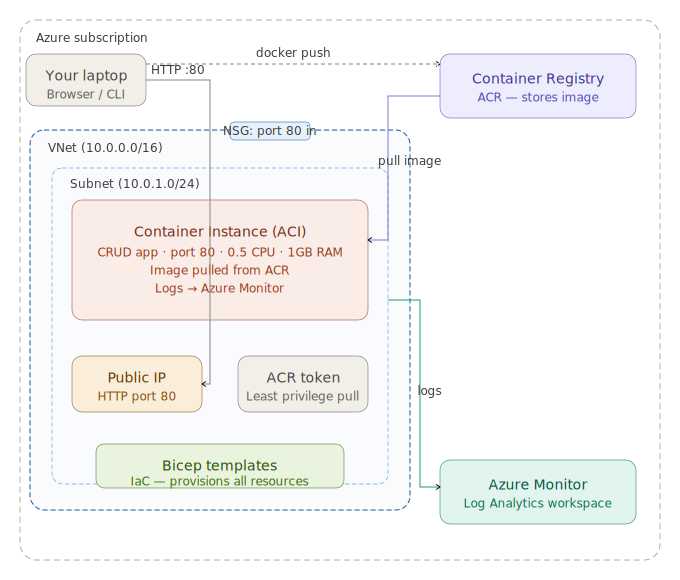

# Azure CRUD App Deployment

Individual assignment — deploying a Flask CRUD application to Azure using Infrastructure-as-Code (Bicep).

## Architecture

> Add your architecture diagram image here after creating it on diagrams.net.
> Export it as PNG, add it to the repo root, and replace the line below.



### Resources created

| Resource | Name | Purpose |
|---|---|---|
| Resource Group | crud-rg | Container for all Azure resources |
| Container Registry | crudacr... | Stores the Docker image |
| ACR Token | pull-token | Least-privilege image pull access |
| Log Analytics Workspace | crud-log-workspace | Receives container logs for Azure Monitor |
| Network Security Group | crud-nsg | Firewall — allows port 80 in, denies all else |
| Virtual Network | crud-vnet | Dedicated network for the application |
| Subnet | crud-subnet | Subnet inside the VNet with ACI delegation |
| Container Instance | crud-container-group | Runs the CRUD app on port 80 with a public IP |

---

## Repository structure

```
crud-azure-assignment/
├── infra/
│   ├── acr.bicep       # Creates ACR + least-privilege pull token
│   └── main.bicep      # Creates VNet, NSG, Log Analytics, and ACI
└── example-flask-crud/
    ├── Dockerfile       # Container image definition
    ├── app/             # Flask application code
    ├── crudapp.py       # App entry point
    └── requirements.txt
```

---

## Prerequisites

- [Azure CLI](https://learn.microsoft.com/en-us/cli/azure/install-azure-cli) installed
- [Docker Desktop](https://www.docker.com/products/docker-desktop/) installed and running
- An active Azure subscription
- Logged in to Azure: `az login`

---

## Deployment steps

### 1. Create resource group and deploy ACR

```bash
az group create --name crud-rg --location westeurope

az deployment group create \
  --resource-group crud-rg \
  --template-file infra/acr.bicep
```

### 2. Build and push the container image

```bash
# Get your ACR name
ACR_NAME=$(az acr list --resource-group crud-rg --query "[0].name" -o tsv)
ACR_SERVER=$(az acr show --name $ACR_NAME --query loginServer -o tsv)

# Build, tag and push
cd example-flask-crud
docker build -t $ACR_SERVER/crud-app:latest .
az acr login --name $ACR_NAME
docker push $ACR_SERVER/crud-app:latest
```

### 3. Generate the pull token password

```bash
az acr token credential generate \
  --name pull-token \
  --registry $ACR_NAME \
  --resource-group crud-rg \
  --query "passwords[0].value" -o tsv
```

Save the output — you need it in the next step.

### 4. Deploy the full infrastructure

```bash
az deployment group create \
  --resource-group crud-rg \
  --template-file infra/main.bicep \
  --parameters acrLoginServer=$ACR_SERVER acrTokenPassword="YOUR_TOKEN_PASSWORD"
```

### 5. Get the public IP and open the app

```bash
az container show \
  --name crud-container-group \
  --resource-group crud-rg \
  --query ipAddress.ip -o tsv
```

Open `http://<public-ip>` in your browser.

---

## Best practices implemented

- **Least privilege access** — ACR admin user is disabled. A token with read-only scope is used for image pulls.
- **Network isolation** — a dedicated VNet and subnet are created with Bicep. The subnet has an ACI service delegation.
- **Firewall rules** — an NSG allows only inbound HTTP traffic on port 80 (priority 100) and denies all other inbound traffic (priority 200).
- **Monitoring** — all container logs are sent to a Log Analytics workspace and are viewable in Azure Monitor.
- **Minimal resources** — the container runs on 0.5 CPU and 1GB RAM to minimise Azure credit usage.
- **Secure parameters** — the token password is marked `@secure()` in Bicep so it is never logged or stored in deployment history.

---

## Viewing logs in Azure Monitor

1. Go to the Azure portal → Log Analytics workspaces → crud-log-workspace
2. Click **Logs**
3. Run this query:

```kusto
ContainerInstanceLog_CL
| take 10
```

---

## Cleanup

Delete all resources after the assignment to save Azure credits:

```bash
az group delete --name crud-rg --yes --no-wait
```
